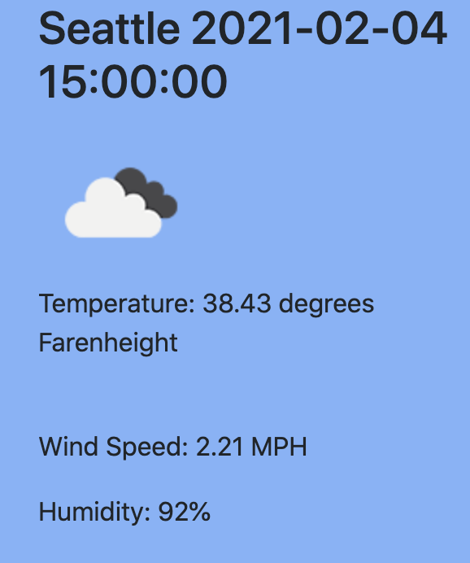
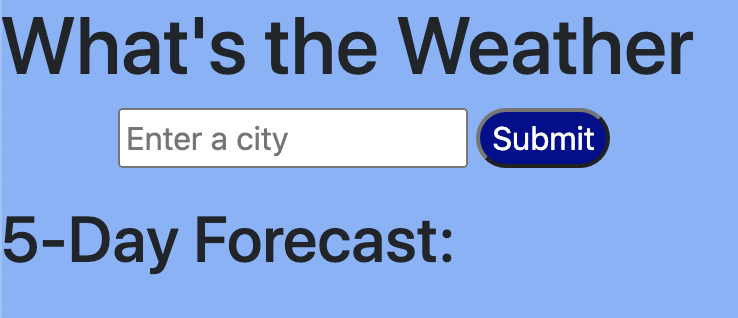
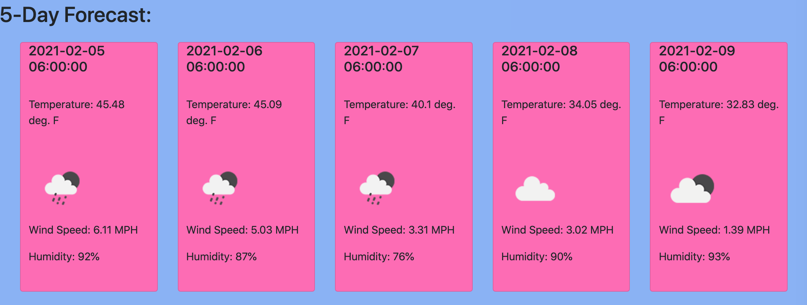

# global_weather_calendar
## overview
This application allows a user to search for any city and the weather forecast will be displayed for that day and future days. The user will be able to see the humidity, the temperature and an icon that displayes they type of weather (sunny, cloudy, rainy, snowy etc.). 

The user is first given a form to fill out the desired city and must click the submit button. After the button is clicked the user will be presented with the weather from that day.

There will also be 5 containers that will display the weather forcast data for the next five days.

## technology
The technology used to develop this app is openweathermap API, JavaScript, Bootstrap, and CSS. The openweathermap api allows the javascript to display the desired data on the webpage. The API also makes it easy to display icons that change according to the weather of the searched city.

## Deployment
This app is still in development. When the app is fully finished the UVI index for each day will be displayed. The user will also have access to previous searches through the use of local storage. This will allow the user to "reload" information from previous searches. Also, the user might notice that if they search multiple cities, the previous data will still be displayed. When the final application is deployed the user will only see one set of results at a time.
## url
https://mikeyp957.github.io/global_weather_calendar/